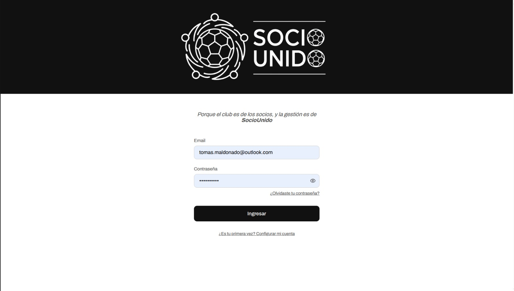
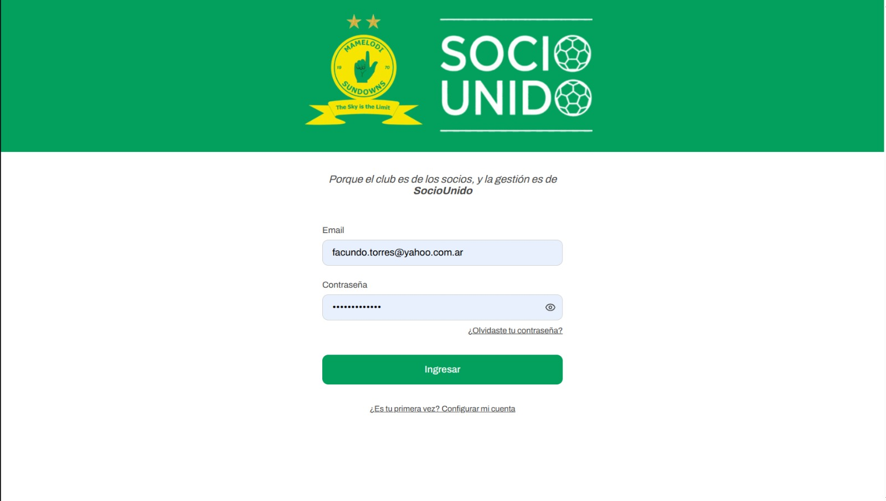
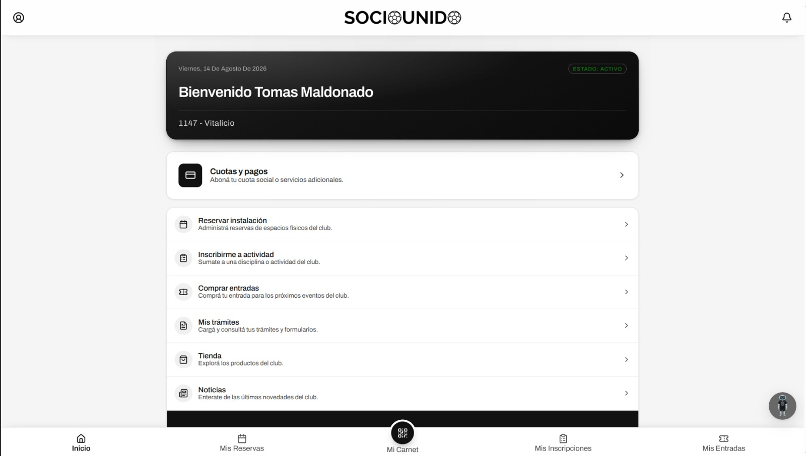
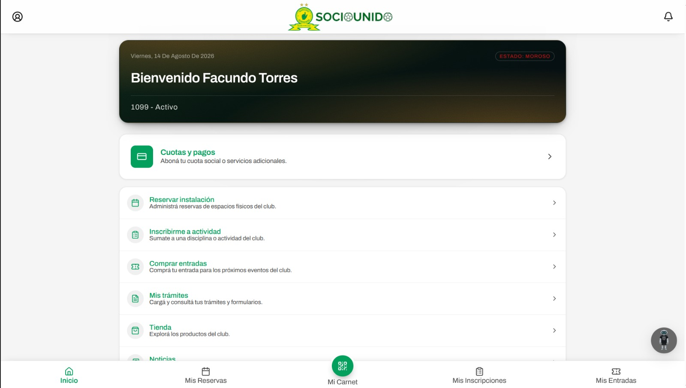
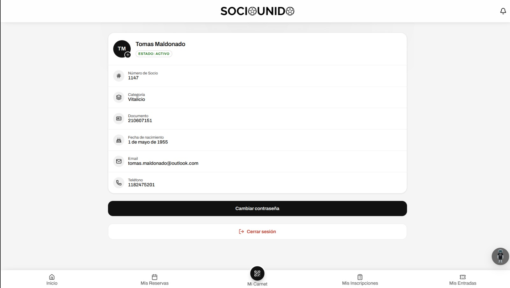
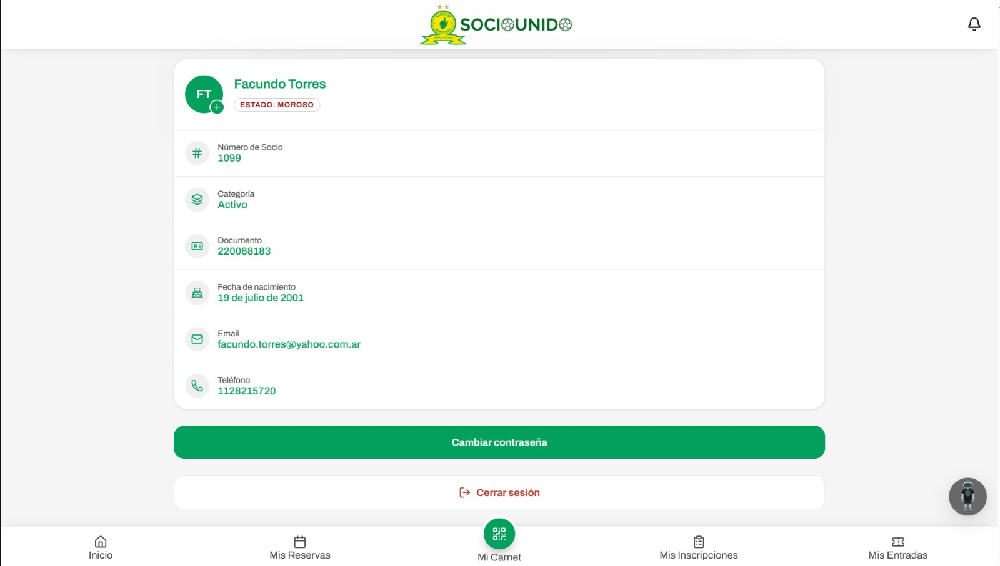
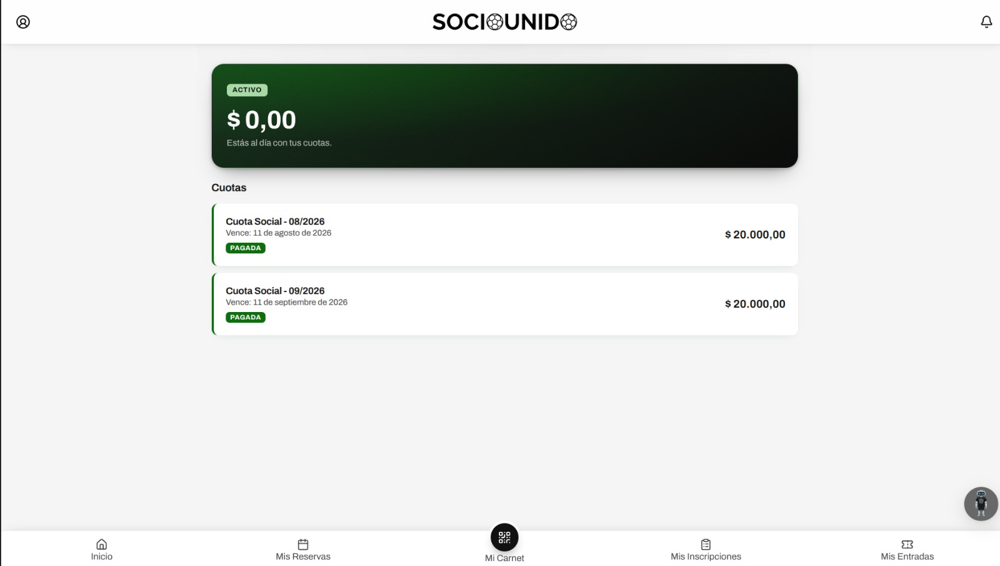
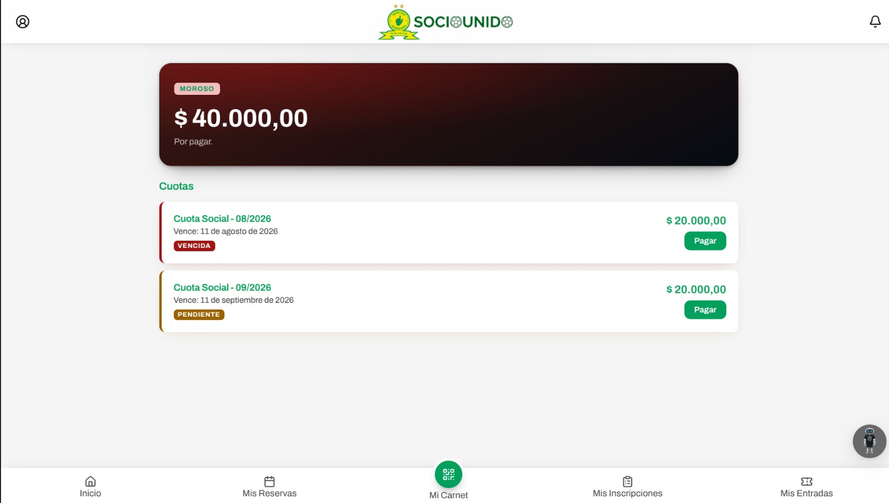
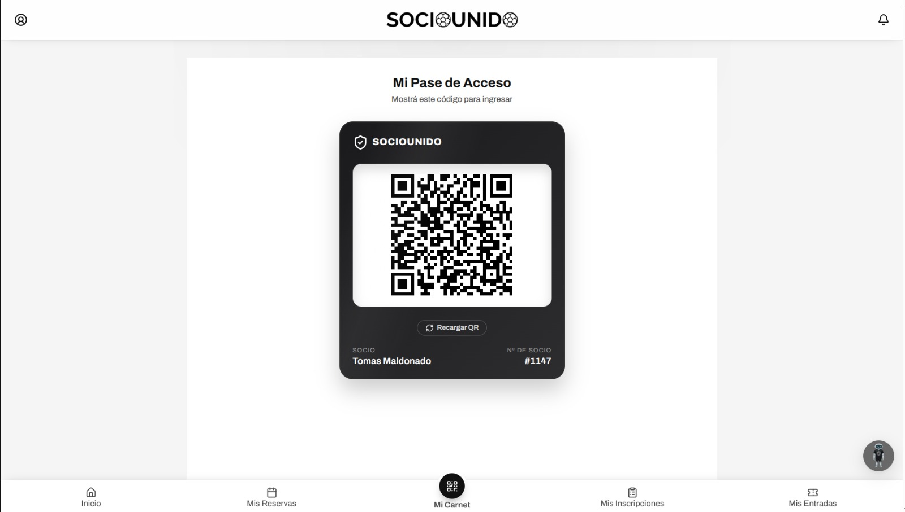
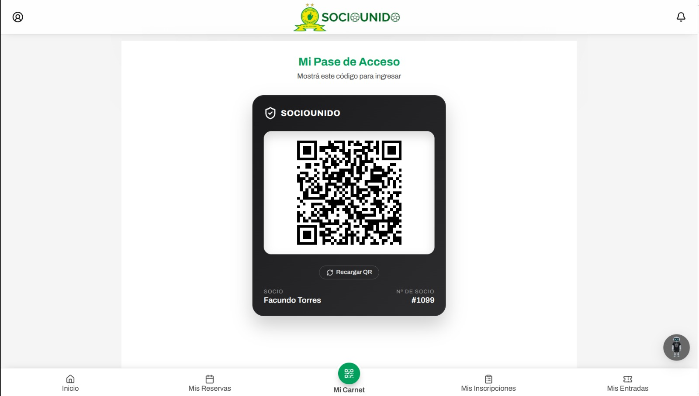

# App del socio (PWA)

Aplicación Web Progresiva diseñada para el usuario final. Centraliza la experiencia del asociado permitiéndole gestionar su perfil, abonar cuotas, y acceder a su carnet digital de manera ágil y con soporte offline.

## Comparativa de vistas (Neutra vs. Implementación)

## 🔐 Pantalla de acceso (Login)

### Marca blanca (Neutro)

### Mamelodi Sundowns

## 🏠 Inicio (Dashboard del socio)

### Marca blanca (Neutro)

### Mamelodi Sundowns

## 👤 Perfil de usuario

### Marca blanca (Neutro)

### Mamelodi Sundowns

## 💳 Estado de pagos y cuotas

### Marca blanca (Neutro)

### Mamelodi Sundowns

## 🎫 Carnet digital (Acceso inteligente)

### Marca blanca (Neutro)

### Mamelodi Sundowns

