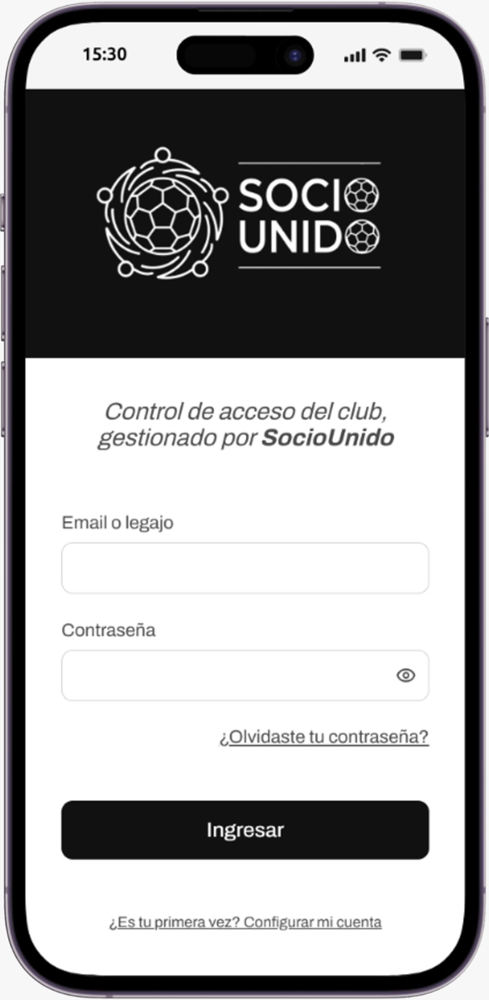
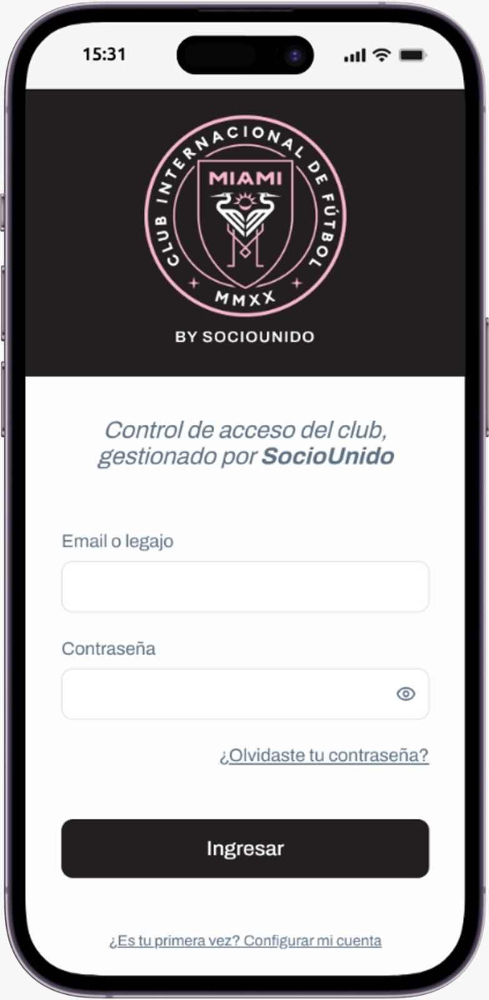
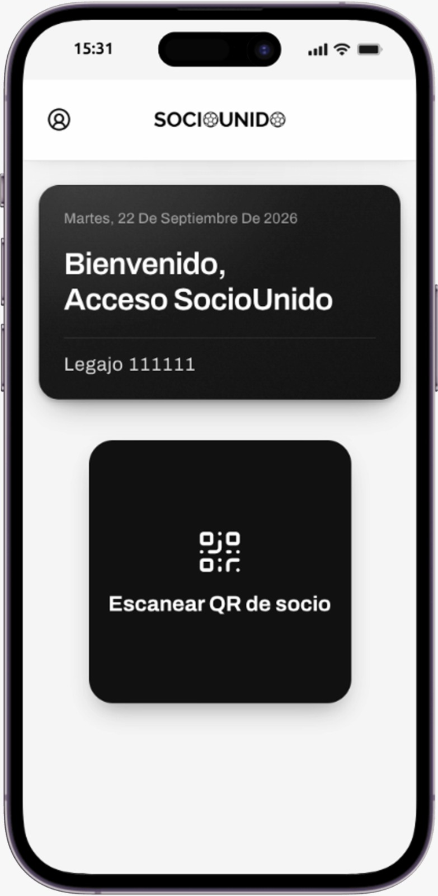
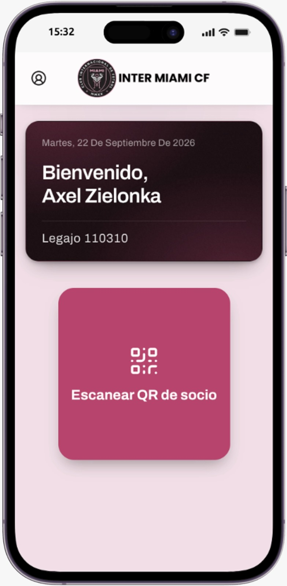
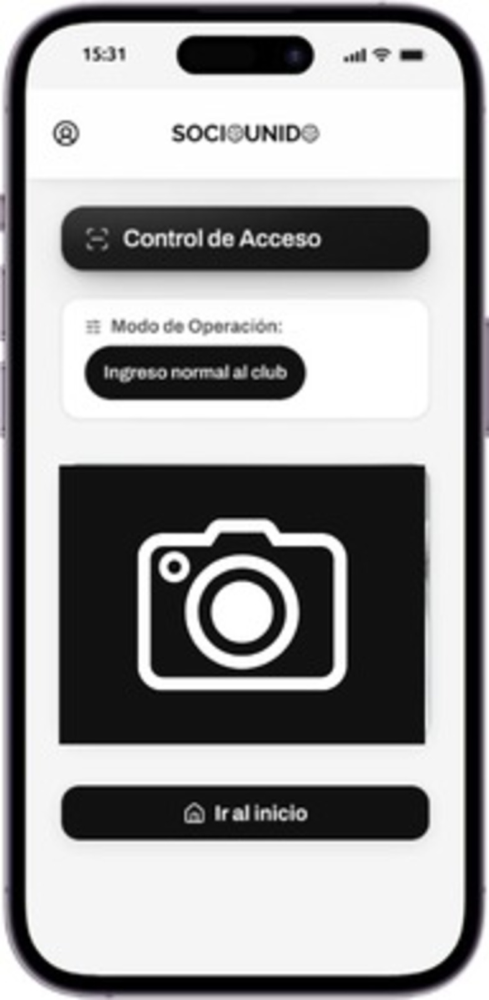
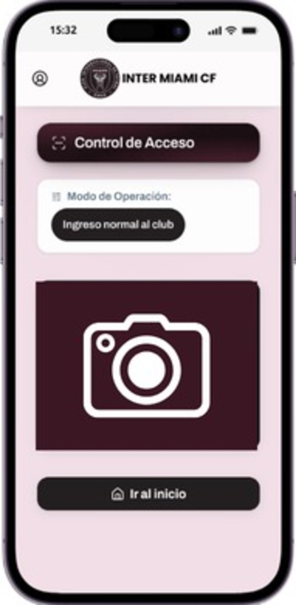

# App del empleado (PWA)

Aplicación móvil orientada al personal operativo y de campo del club. Está diseñada para facilitar las tareas cotidianas, la lectura rápida de credenciales y el control de accesos en los molinetes o puntos de entrada institucionales.

## Comparativa de vistas (Neutra vs. Implementación)

## 🔐 Acceso de personal (Login)

  

    <h4>Marca blanca (Neutro)</h4>
    
  

  

    <h4>Inter Miami CF</h4>
    
  

## 🏠 Panel principal operativo

  

    <h4>Marca blanca (Neutro)</h4>
    
  

  

    <h4>Inter Miami CF</h4>
    
  

## 📷 Lector de código QR

  

    <h4>Marca blanca (Neutro)</h4>
    
  

  

    <h4>Inter Miami CF</h4>
    
  

