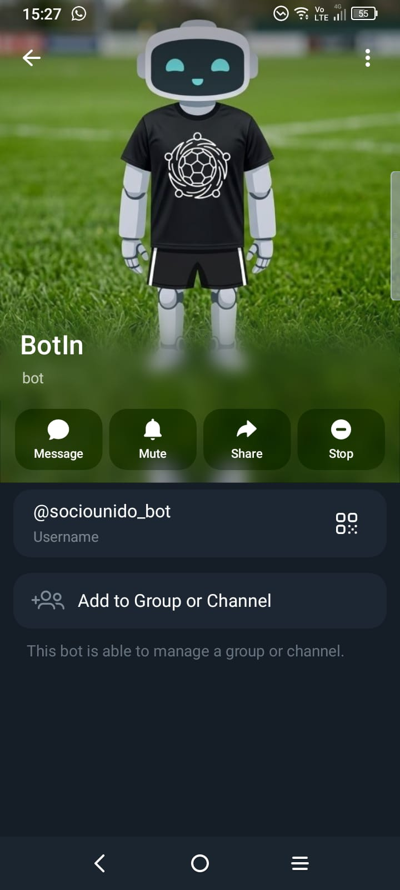
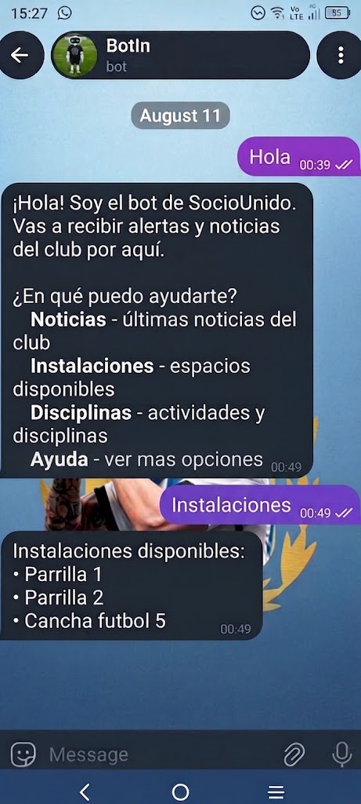

# Bot Conversacional (BotIn)

**BotIn** es el asistente virtual de la plataforma, integrado nativamente con Telegram a través del procesamiento de lenguaje natural (NLP). Facilita la autogestión de los socios respondiendo consultas frecuentes, asistiendo en el pago de cuotas y brindando soporte 24/7.

### Perfil institucional en Telegram

  
   
  <em>Vista de la información de contacto y verificación del bot.</em>

### Interacción y flujo de mensajes

  
   
  <em>Ejemplo de conversación guiada y resolución de consultas del usuario.</em>

