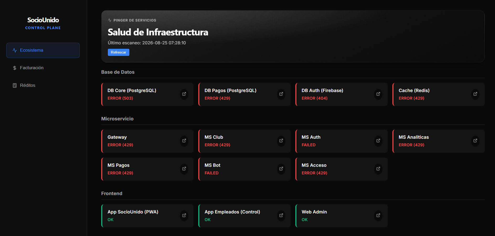
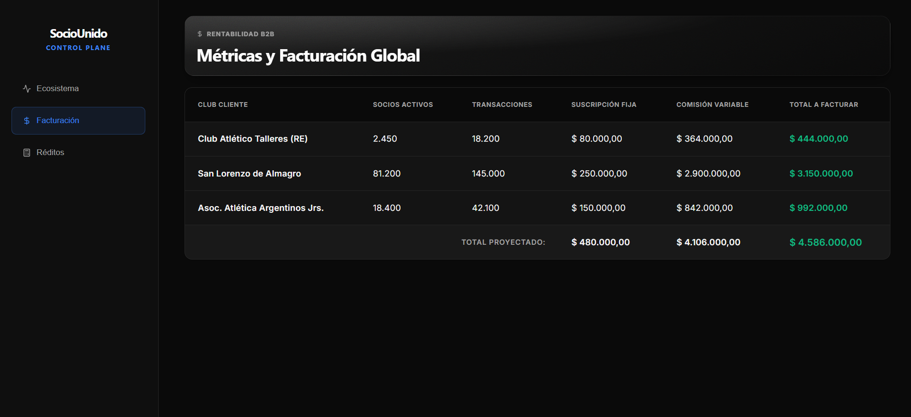
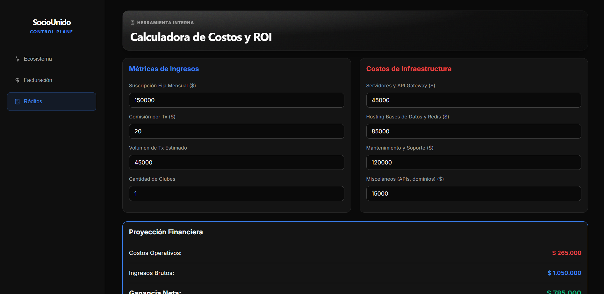

# HealthChecker

Panel de control dedicado al monitoreo continuo de la infraestructura. Esta interfaz permite al equipo técnico visualizar en tiempo real el estado y la disponibilidad del ecosistema.

### Vista de monitoreo - Ecosistema

  
   

### Vista de monitoreo - Facturación

  
   

### Vista de monitoreo - Réditos

  
   

