# Plataforma web (Panel de gestión)

La plataforma web es el panel administrativo centralizado orientado a la dirigencia, administración y personal operativo del club. Permite la gestión integral del padrón, métricas financieras, disciplinas y configuración de la tienda.

## Comparativa de vistas (Neutra vs. Implementación)

## 🔐 Login y autenticación

### Marca blanca (Neutro)

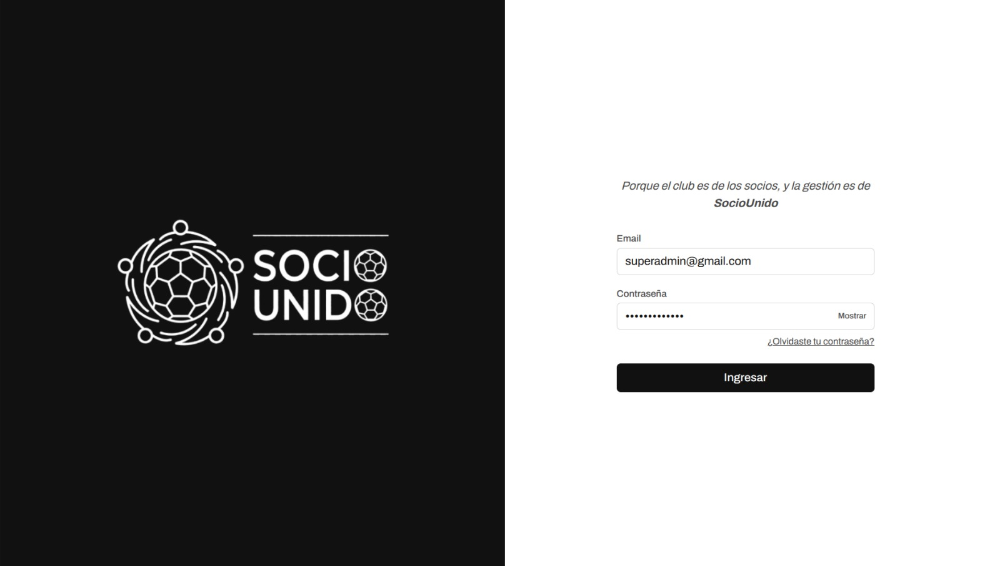

### Mamelodi Sundowns

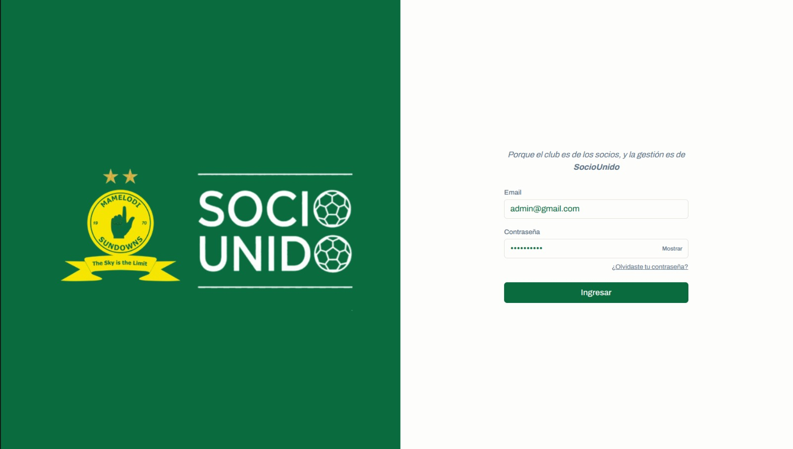

## 🏠 Inicio (Home)

### Marca blanca (Neutro)

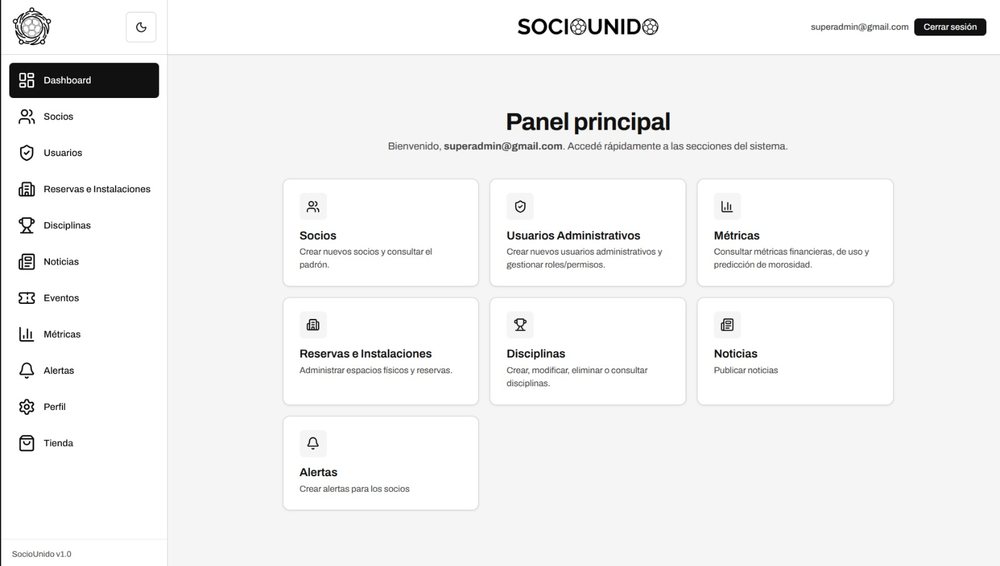

### Mamelodi Sundowns

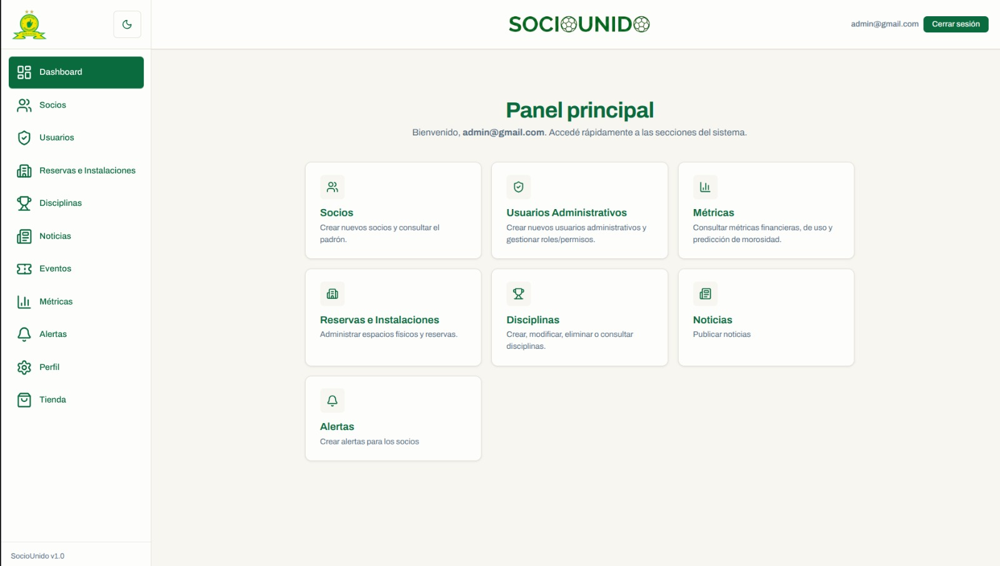

## 📈 Métricas y estadísticas

### Marca blanca (Neutro)

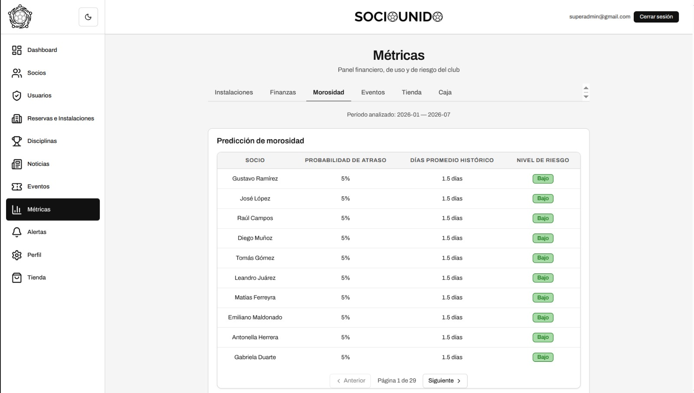

### Mamelodi Sundowns

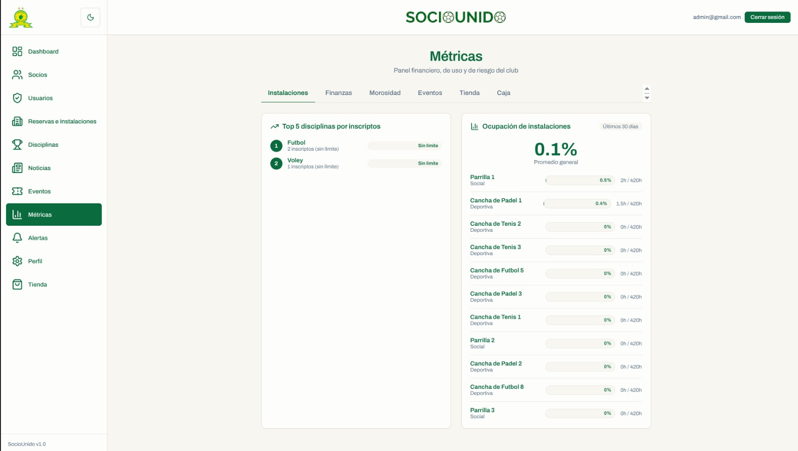

## 📋 Gestión de socios (Padrón general)

### Marca blanca (Neutro)

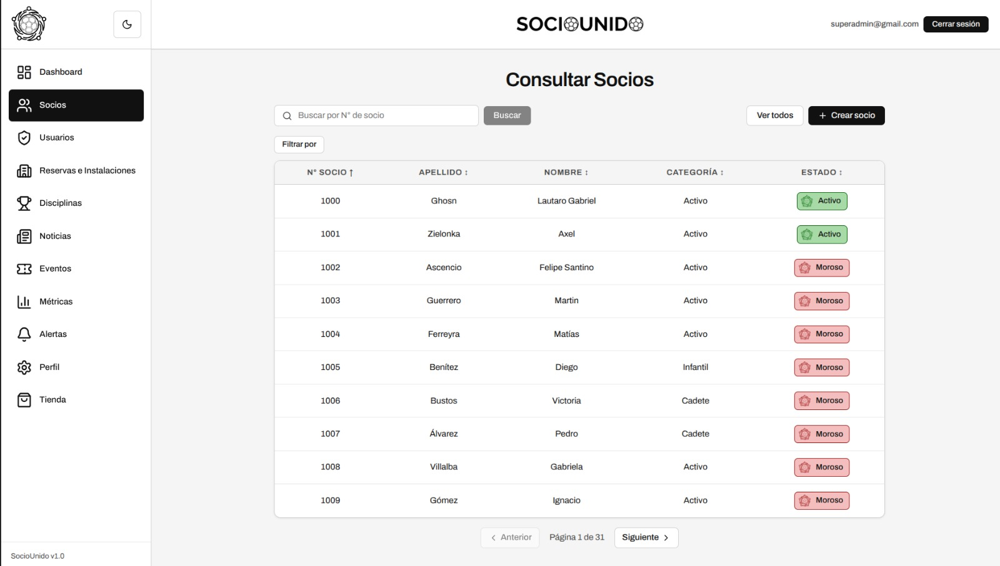

### Mamelodi Sundowns

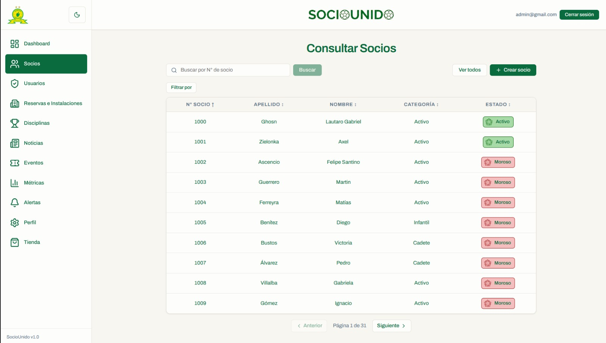

## 👤 Perfil de socio específico

### Marca blanca (Neutro)

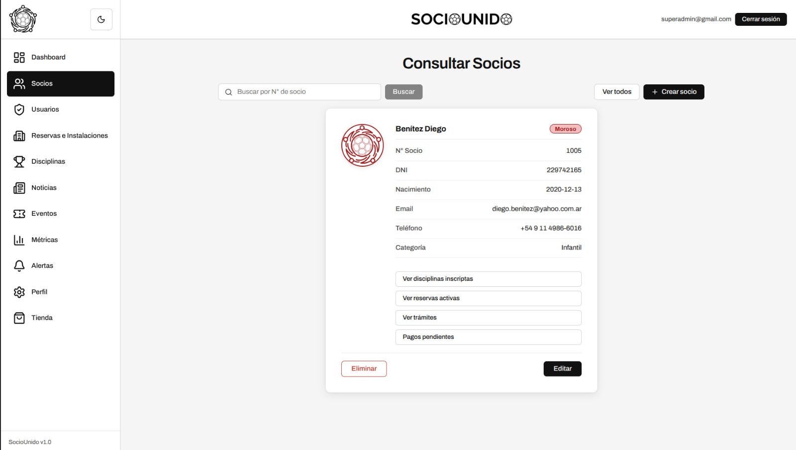

### Mamelodi Sundowns

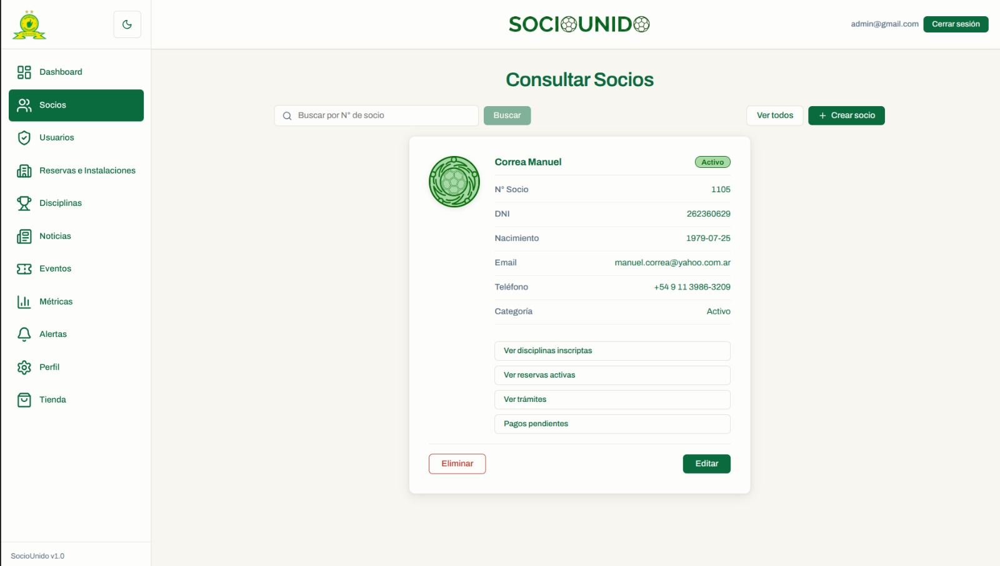

## ⚽ Gestión de disciplinas (General)

### Marca blanca (Neutro)

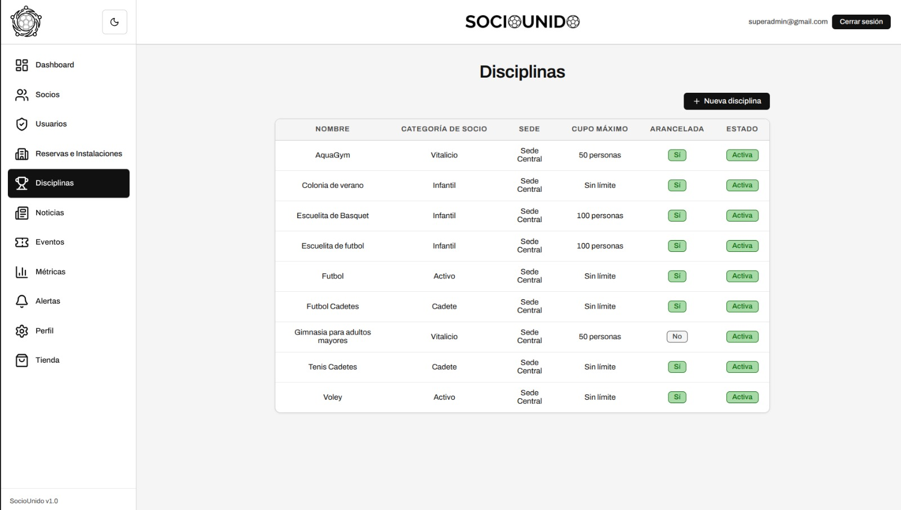

### Mamelodi Sundowns

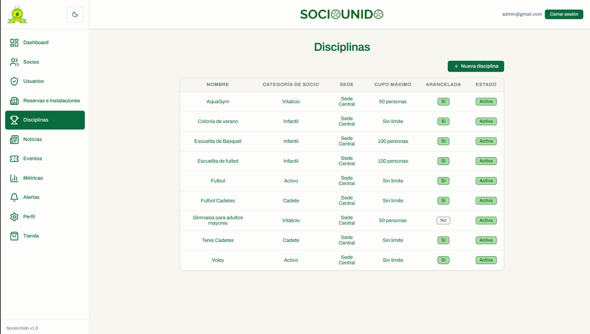

## 🏋️ Disciplina específica

### Marca blanca (Neutro)

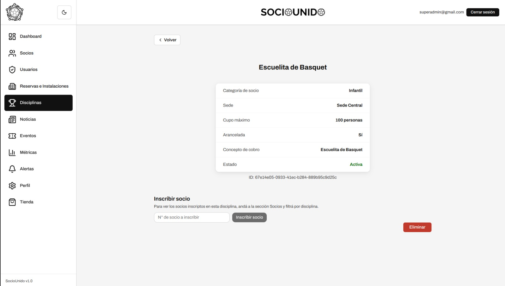

### Mamelodi Sundowns

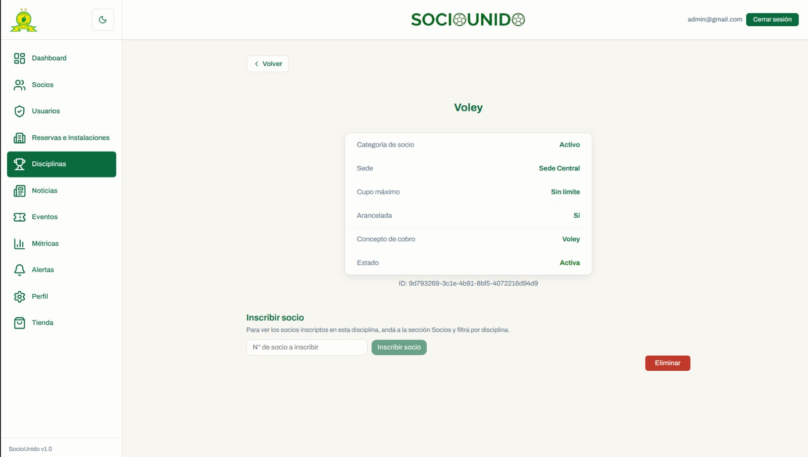

## 🛒 Tienda institucional

### Marca blanca (Neutro)

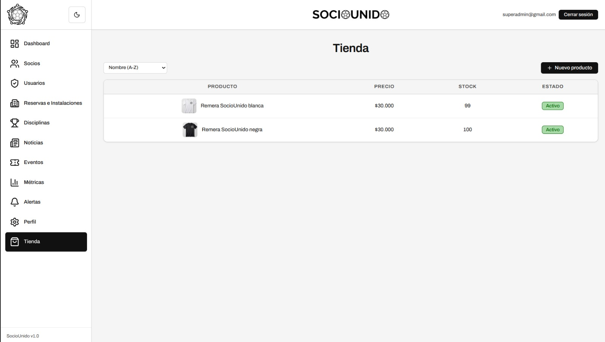

### Mamelodi Sundowns

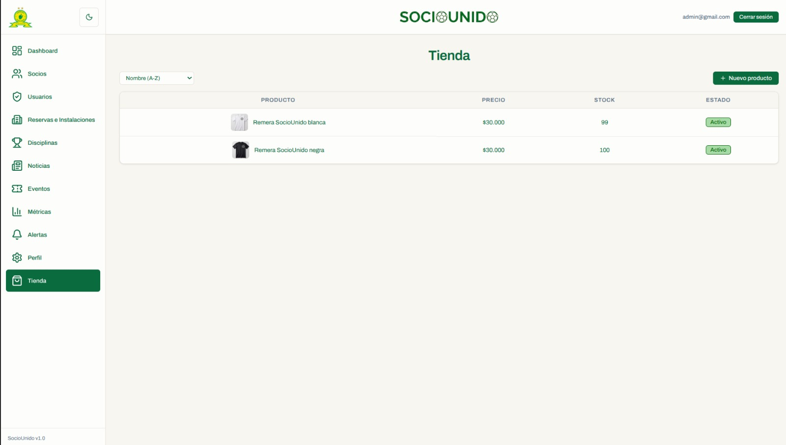
