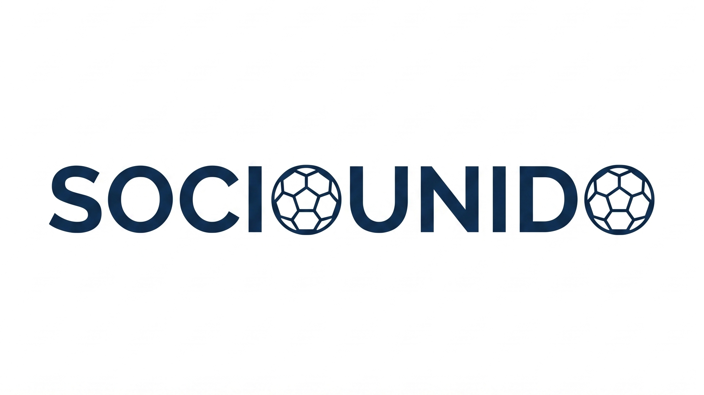
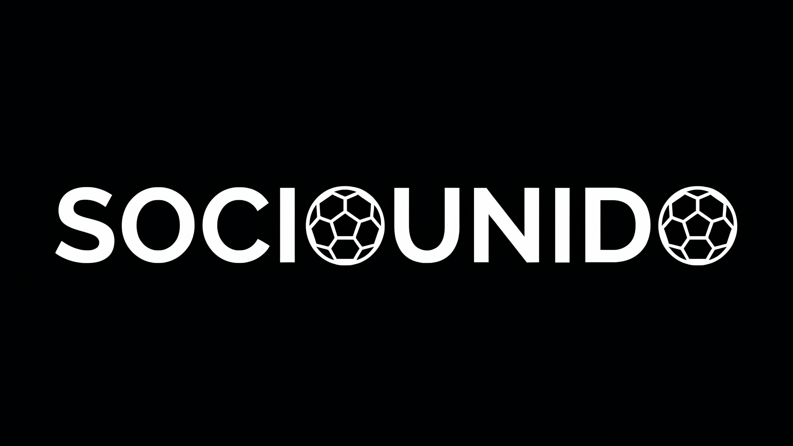
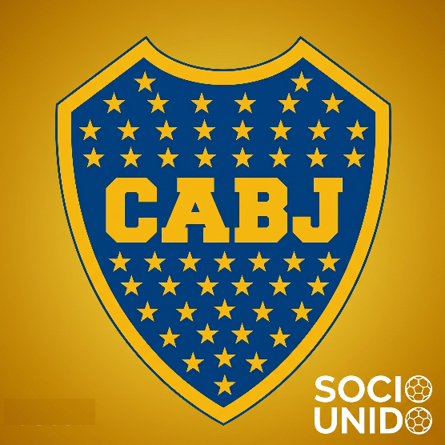
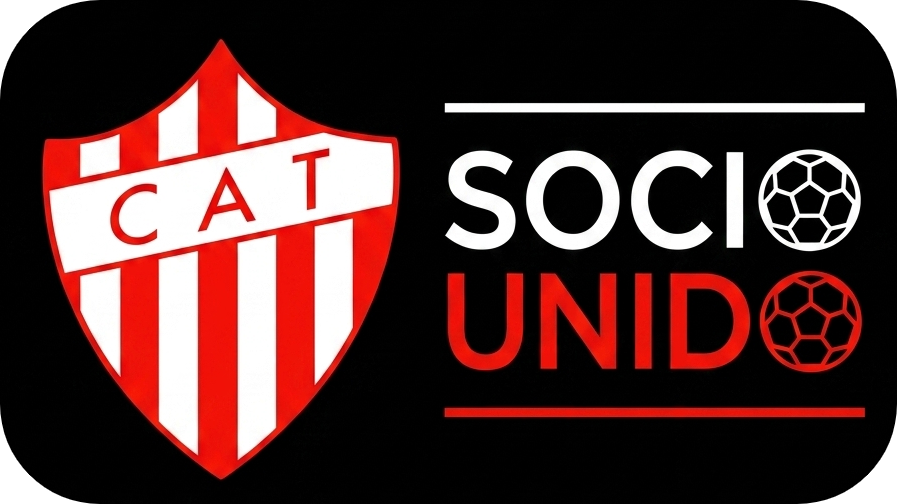
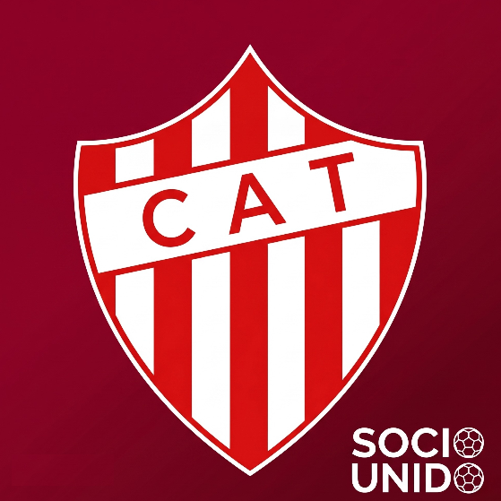
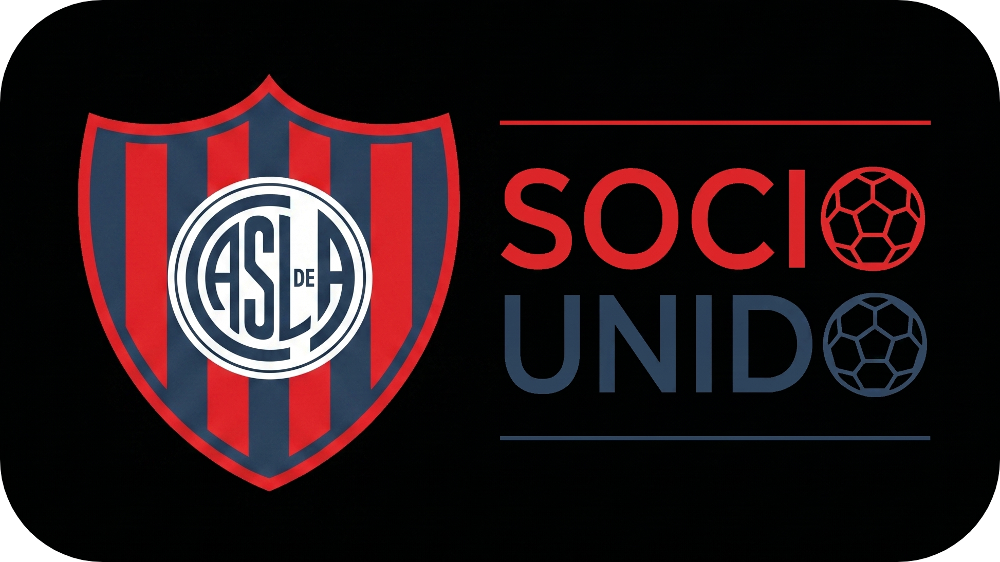
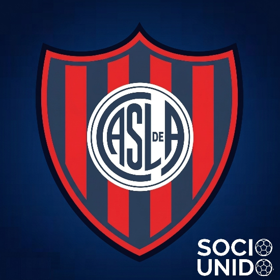

# Representaciones de marca

Este apartado recopila los recursos visuales y logotipos utilizados en el ecosistema. Al tratarse de una solución concebida como **marca blanca**, la plataforma cuenta con una identidad gráfica base (SocioUnido) y esquemas de adaptación rápida para las distintas instituciones deportivas.

## ⚪ SocioUnido (Marca blanca)

Logotipos base, reducciones y recursos para la aplicación genérica por defecto.

### Representaciones de marca (Imagen principal)

Composiciones completas institucionales que incluyen el isotipo (personas formando una pelota) y la tipografía. Se utilizan para la identidad visual principal de la plataforma.

* **Logo SocioUnido (Oscuro)**
   
* **Logo SocioUnido (Claro)**
   
* **Ícono App SocioUnido**
   

### Reducciones (Firmas, detalles y cabeceras)

Versiones apaisadas y tipográficas (solo texto) pensadas para optimizar el espacio en barras de navegación, firmas de documentos, encabezados y detalles de interfaz.

* **Reducción clara**
   
* **Reducción oscura**
   
* **Header estándar**
   

## 🏟️ Clubes de Ejemplo

Ejemplos de cómo la marca blanca muta para adoptar la paleta de colores y escudos de instituciones específicas.

### Club Atlético Boca Juniors

* **Logo institucional**
   
* **Ícono de App**
   

### Club Atlético Talleres (Remedios de Escalada)

* **Logo institucional** 
   
* **Ícono de App**
   

### Club Atlético San Lorenzo de Almagro

* **Logo institucional**
   
* **Ícono de App**
   
